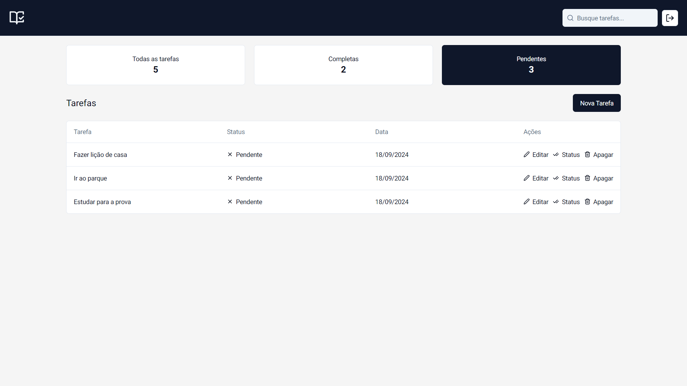
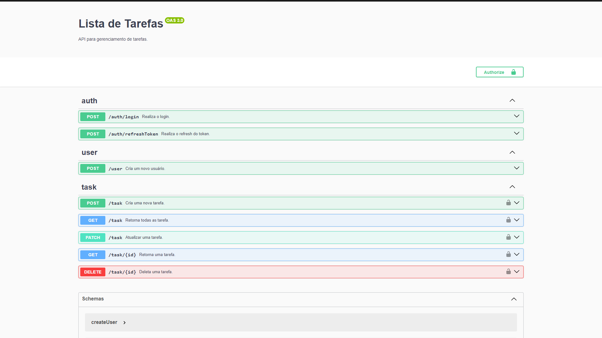

# Lista de Tarefas
A aplicação é uma ferramenta para gerenciar tarefas. Com ela, você pode criar, visualizar, editar e excluir tarefas.

#### [✈️ VISITAR PROJETO](https://listadetarefas-luiz2k.vercel.app)

## 📖 Sobre o FRONT-END

A aplicação foi desenvolvida utilizando **Next.JS** e **Tailwind CSS**. O fluxo de autenticação foi implementado com **JWT**, utilizando **middlewares** do **Next.JS** para gerenciar a sessão do usuário e o refresh token. Todos os formulários da aplicação foram validados com **React Hook Form** e **Zod**. No painel de administração das tarefas, foi desenvolvido um filtro para diferenciar tarefas concluídas e abertas, e foi implementada também uma barra de pesquisa no header para facilitar a busca por tarefas.

### ⚙️ Tecnologias usadas:
- [Next.js](https://nextjs.org/)
- [Typescript](https://www.typescriptlang.org/)
- [Tailwind CSS](https://tailwindcss.com/)
- [React Hook Form](https://react-hook-form.com/)
- [Zod](https://zod.dev/)
- [Shadcn/ui](https://ui.shadcn.com/)

## 📖 Sobre o BACK-END

A aplicação foi desenvolvida seguindo os princípios do **SOLID**, utilizando **Express.JS** e **TypeScript**. Foi implementado um sistema completo CRUD de tarefas e um fluxo de autenticação com **JWT**. Todas as rotas da aplicação foram documentadas com **Swagger**, e **testes unitários** foram implementados com **Vitest**. Além disso, foi criado um **middleware** para lidar com instâncias de erros.

### ⚙️ Tecnologias usadas:
- [Node.JS](https://nodejs.org/pt/)
- [Express.JS](https://expressjs.com/)
- [Typescript](https://www.typescriptlang.org/)
- [TypeORM](https://typeorm.io/)
- [PostgreSQL](https://www.postgresql.org/)
- [Vitest](https://vitest.dev/)
